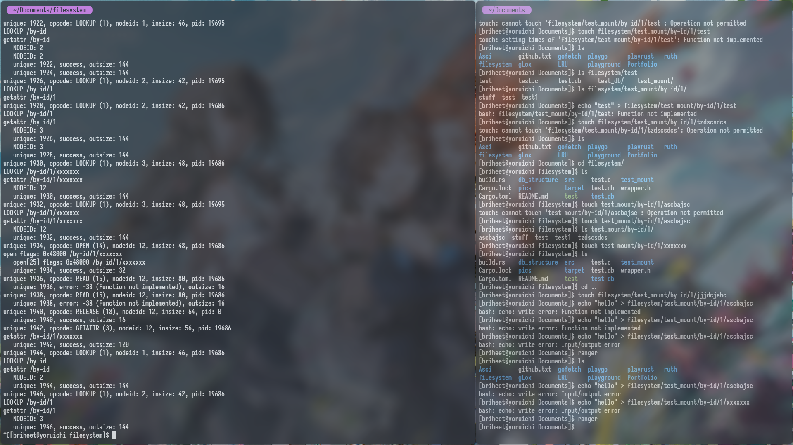

# FUSE

Info from [Here](https://github.com/libfuse/libfuse)

Making a fuse filesystem

Current Scenario: You can do operations like touch and echo in a file easily.

The main idea is to view relationship in a database. I can create Sym links but
going back is not the option and multiple Symlinks would be a headache. Hence we are here.

The files also have custom links for you to navigate.

- How to run for now:

```bash
# Check if there is some issue or not
cargo check

#Build and run
cargo build

# Sometimes there is an issue with fuse and it would give aborted or FUSE error: Transport endpoint is not connected, for this, run
sudo umount test_mount
cargo run -- -d test_mount
```

Repeat this until it starts working, you can view the issue [here](https://stackoverflow.com/questions/16002539/fuse-error-transport-endpoint-is-not-connected)

- For compiling the C file and only testing from it

```bash
#Fuse version check and if not there install it with your package manager
fuse --version

# Compile the FUSE program
gcc -lfuse -o test test.c

# Run the FUSE program with a mount point
./test -d test_mount
```

- To Run the database for now

```bash
cargo run -- test_db
```

- To Check the files are created or not first install sqlitebrowser or any other tool

```bash
sqlitebrowser test_db/metadata.db
```

- Things done till now
- Tried the dummy filesystem written in C
- Built our storage in rust
- Hardcoded our files
- Generate bindings and write a fn for running the filesystem just like C would do with rust
- Done writing the getattr and readdir for now
- Impl other remaining write, utimens, truncate, open, create, etc


